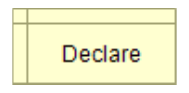

  <h1>Curso programación en C++</h1>

# Introducción al documento

El contenido de este documento esta basado en el curso de Udemy del profesor Alejandro Miguel Taboada Sanchez

# Tabla de contenido
  - [Introducción](#Operadores-aritméticos)
    - [¿Que es la Programación?](#¿Qué-es-una-variable?)
    
 - [Programación con diagramas de flujo ](#Herramientas-para-programar)
    - [¿Qué es un diagrama de flujo?](#Operadores-aritméticos)
    - [¿Para qué se usa un diagrama de flujo?](#Operadores-aritméticos)
    - [Ejercicio 3 Calcular promedio](#¿Qué-es-una-variable?)
    - [Ejercicio 4 Porcentajes de notas de un alumno](#¿Qué-es-una-variable?)
    - [Ejercicio 5 Hipotenusa de un triangulo rectangulo](#¿Qué-es-una-variable?)
    -  [Ejercicio 6 Programa que use la formula de la resolvente](#Operadores-aritméticos)
    
  - [¿Que compone un diagrama de flujo?](#Construyendo-el-camino-de-un-programa-con-condicionales)
    - [Tipos de datos](#Operadores-aritméticos)
      - [Numero Entero Integer](#Operadores-aritméticos)
      - [Numero Real Float](#¿Qué-es-una-variable?)
      - [Cadena de texto String](#¿Qué-es-una-variable?)
      - [Boolean Data Type](#¿Qué-es-una-variable?)
    -  [Identificadores](#Operadores-aritméticos) 
      -  [Recomendaciones generales sobre los identificadores](#¿Qué-es-una-variable?)
    - [Bloques](#¿Qué-es-una-variable?)
      -  [Bloques de inicio y terminación](#Operadores-aritméticos)
      -  [Bloque declaración](#¿Qué-es-una-variable?)
      -  [Bloque asignación](#Operadores-aritméticos) 
      -  [Bloque entrada](#¿Qué-es-una-variable?)
      -  [Bloque salida](#¿Qué-es-una-variable?)
      -  [Bloque si If](#¿Qué-es-una-variable?)
      -  [Bloque mientras While](#Operadores-aritméticos) 
      -  [Bloque para For](#¿Qué-es-una-variable?)
      -  [Bloque hacer mientras Do While](#¿Qué-es-una-variable?)
   
   
   - [La ejecucion del programa](#Operadores-aritméticos)
    
 - [Otros diagramas de flujo](#Herramientas-para-programar)
    - [BPMN](#Operadores-aritméticos)
    - [UML/SysML](#Operadores-aritméticos)

    
  - [Anexos](#Construyendo-el-camino-de-un-programa-con-condicionales)
    - [Anexo 1 ¿Qué es Flowgorithm?](#Operadores-aritméticos)
    - [Anexo 2 Palabras reservadas](#Operadores-aritméticos)
    - [Anexo 3 Operadores](#¿Qué-es-una-variable?)
    - [Anexo 4 Funciones integradas](#¿Qué-es-una-variable?)
    - [Anexo 5 Constantes](#¿Qué-es-una-variable?)
    - [Anexo 6 Guia de mensajes de error](#Operadores-aritméticos) 

## Introducción
De acuerdo con la naturaleza del funcionamiento de las computadoras, se dice que estas
siempre ejecutan órdenes en un formato que les resulta inteligible; dichas órdenes se agrupan
en programas, conocidos como Software, el cual, para su estudio, a su vez, se divide en dos
partes: el formato de representación interno de los programas, que constituye el código de
máquina, y el formato de presentación externa, que es un archivo o un conjunto de archivos, que
están en un formato que puede ser leído por el usuario esto es también llamado código fuente.
Qué tan “en código” estén depende de la herramienta usada para expresar el programa, siendo
algunos más simples y otros más complejos.
Para ejecutar lo que el usuario desea hacer en su computadora, o bien para resolver un
problema específico, este precisa buscar un software que realice o ejecute con exactitud la
tarea que se ha planteado o elaborar y desarrollar (escribir) un programa que la realice. El
trabajo de elaboración de un programa se denomina “programación”. Pero la programación no es
solo el trabajo de escritura del código, sino todo un conjunto de tareas que se deben cumplir, a
fin de que el código que se escribió resulte correcto y robusto, y cumpla con el objetivo o los
objetivos para los que fue creado.

## ¿Qué es la Programación?
Teniendo en cuenta la separación de las representaciones internas y externas, la programación
es transformar un problema de forma que sea comprendido por la computadora.
Formalmente, la programación es el proceso utilizado para idear y ordenar las acciones
necesarias para realizar la solución a un problema.
Conceptualmente, la programación no es exclusiva de las computadoras y podemos utilizar los
mismos conceptos para gestionar grupos de trabajo, pero la diferencia radica en el nivel de
detalle necesario en la programación. Las seres humanos somos hábiles en completar los
huecos en las instrucciones, en cada tarea similar no es necesario indicarles que hacer con
todos los detalles. Mientas que las computadoras necesitan siempre las instrucciones precisas
y exactas para completar su tarea.

## ¿Qué es un Diagrama de Flujo?
Un Diagrama de Flujo es una representación gráfica de los pasos en la resolución de problemas.
Estos se componen de diversos símbolos, formas geométricas, que son utilizadas para
representar los pasos individuales de la solución. Y cada una de estas figuras se encuentran
conectadas por una flecha de una sola dirección que establece la secuencia de las
instrucciones.
Esta representación grafica, simplifica la nociones más importante del funcionamiento de una
computadora a la hora de ejecutar programas: el orden de las instrucciones, la computadora
solo sigue las instrucciones paso a paso.
En el momento que fue estandarizado (ISO1028:1973) las computadoras eran mucho más
simples y los lenguajes más complicados; en aquella época, la prioridad estaba en sacar el
máximo provecho a los escasos recursos de las computadoras, a expensas hacer el trabajo más
difícil a los programadores. En esa época, los microprocesadores fueron inventados hacia poco
tiempo, un Intel 4004 era capaz de procesar 0,092 millones de instrucciones por segundo y para
que puedan comparar con un procesador moderno, un AMD 3990X es capaz de ejecutar
2.356.230 millones de instrucciones por segundo; estos son muchos ordenes de magnitud
juntos.
Otra forma de ver estas comparaciones pasa por comprender que un cargador de una notebook
o teléfono, tiene más capacidad de calculo que la computadora que llevo al hombre a la luna.

## ¿Para qué se una un Diagrama de Flujo?
El principal uso de los diagramas de flujo, es dar una representación visual simplificada de la
estructura de un programa, dando un punto de vista diferente al mismo.
De la misma manera que la programación con lenguajes basados en texto, esta es una
herramienta para comunicar. Por un lado, la intención de resolver un problema a la computadora
y también, comunicar esta intención a nuestros pares para que puedan colaborar en el
desarrollo.

## ¿Qué compone un diagrama de Flujo?
Antes de comenzar a programar, tenemos que describir el lenguaje que utilizaremos más que
información podemos consumir y producir.
Al final de esta sección se encuentra la guiá para la herramienta que utilizaremos

## Tipos de datos
Las computadoras necesitan saber exactamente con que estamos tratando, no es posible
mezclar letras, texto y números. 1 Concretamente, esto es por la complejidad adicional asociada
a poder procesar información de cualquier manera, en la programación se prefiere mantener
todo lo más simple posible. Y por otro lado, el que el lenguaje solo pueda utilizar un tipo de dato
a la vez, ayuda a detectar problemas del tipo “peras vs. naranjas”, ya que el programa no
funcionara si se produce una operación entre datos que tienen que ser del mismo tipo, por
ejemplo; sumar una palabra con un numero.
Los tipos de datos, se asocian a un nombre, que dan lugar a las variables. Estos son los lugares
en los que uno almacena información para utilizar en el programa, ya sea como un dato que se
le pide ingresar, un dato interno necesario para el funcionamiento del programa o el resultado
que será mostrado al usuario del programa.
A lo largo de la carrera estudiaremos la forma en la que se almacena la información en la
computadora, por ahora, taparemos ese detalle.
Entre paréntesis en cada tipo de dato va su nombre en inglés, el cual es ampliamente utilizado
en las herramientas e información disponible en internet.

## Numero Entero (Integer)
El tipo de datos Entero puede almacenar un número entero positivo o negativo, pero no puede
almacenar valores decimales (fraccionarios). Por lo tanto, puede almacenar valores como 5, 42,
1947, pero no puede almacenar números como 3.2, 4.5, etc.
Si un número con un valor fraccionario se almacena en un número entero, el valor fraccionario
se descartará. Por lo tanto, si 3.2 se almacena en un número entero, solo retendrá 3. Existen lenguajes que son más flexibles, pero esta flexibilidad trae sus propios problemas.

## Numero Real
El tipo de datos Real puede almacenar cualquier número, tanto números enteros como valores
con valores fraccionarios. En muchos lenguajes de programación se lo denominan "doble"
después del estándar de implementación conocido como "coma flotante de precisión doble".
(ISO 754)

## Cadena de texto (String)
El tipo de datos String se usa para almacenar cualquier información textual. Esto incluye
palabras, letras o cualquier otra cosa que envíe en un mensaje de texto. En la programación, el
texto está delimitado con comillas dobles. Por ejemplo: "CSU, Sacramento", "computadora" y
"Año 1947" son todos ejemplos de cadenas de texto.

## Boolean Data Type
El tipo de datos Boolean puede almacenar "verdadero" o "falso". Estas son la base de la toma de
decisiones en un programa de computadora.

## Identificadores
Cada vez que define una variable, se le asigna un nombre único llamado "identificador". Para
evitar que los identificadores se confundan con otros elementos en una expresión, deben seguir
una serie de reglas.
En Flowgorithm concretamente, los identificadores deben cumplir con las siguientes reglas:
•
 Deben comenzar con una letra.
•
 Después de la primera letra, el identificador puede contener letras o números
adicionales.
• Los espacios no están permitidos.
• No pueden ser palabras reservadas o palabras ya definidas por Flowgorithm (Anexo
2 – Palabras reservadas).
• Los identificadores no distinguen entre mayúsculas y minúsculas.
Tengan en cuenta que estas reglas son a grandes rasgos las mismas a la gran mayoría de
lenguajes de programación, las diferencias dependerán de cada lenguaje.

**Recomendaciones generales sobre los identificadores**
Es usar identificadores con tilde (acento), esto no es una buena idea ya que hacen que existan
nombres que son demasiado similares pero diferentes en un detalle difícil de ver. Limiten los
caracteres usados al alfabeto exclusivamente.2
Ademas y aparte de las reglas del lenguaje, usen siempre que sea posible nombres descriptivos
por ejemplo; edad , cantidad , limite y maximo . Eviten los nombres como a , b , c , x ,
y , z , etc así como también las abreviaturas muy cortas como de , can , lim y demás.
Usar los nombres de las variables de una sola letra, o lo mas cortos posibles se origina en
lenguajes de programación diseñados cuando los recursos disponibles eran una muy pequeña
fracción de lo que existe hoy.

Técnicamente, es posible utilizar también emojis pero si con tildes ya es complicado, usar un
carácter que no podemos indicar con el teclado es solo complicar las cosas.
Las únicas excepciones a esta regla sobre los nombres de las variables los podemos encontrar
en algunas convenciones matemáticas, como i , j y k para contadores (y solo para esa
tarea)
Uno puede alegar que el código del programa no es publico, esto solo no es razón suficiente
como para usar letras individuales o identificadores que no sean representativos de su
propósito.
Por ejemplo, aunque la siguiente:
a = b * c

A pesar de ser correcto, su propósito no es evidente, lo podemos contrastar con:
salario = horas_trabajadas * salario_por_hora
Lo que implica la intención y el significado del código fuente, por lo menos para aquellos que
están familiarizados con el contexto subyacente de la aplicación.
A lo largo del ingreso, utilizaremos identificadores para nombres de variables, pero más adelante
durante la carrera, verán que los mismos se utilizan para bautizar otras partes de un programa y
que su identificación reúne las mismas características.

## Bloques
Luego de conocer los tipos de dato, siguen los bloques con las diversas partes y acciones que
podemos hacer dentro de un programa.

## Bloques de Inicio y Terminación
Todos los programa tienen que empezar por algún lado y en particular solo tienen un punto de
inicio.
A su vez, la finalización de los programas puede darse ante problemas, errores o situaciones no
esperadas, y cuando sucedan, el programa se detendrá en el bloque que dio origen a dicha
situación. Los diagramas de flujo como los vemos, no tienen ningún bloque para gestionar estas
situaciones, lo mejor que podemos hacer es prevenirlas (Ver Anexo 6 - Guía de mensajes de
error).
Por ejemplo; si le pedimos al usuario que ingrese un número entero que será utilizado para
alguna división, puede ser necesario que nos preguntemos si lo que ingreso el usuario no es
cero, ya que la división por cero es una condición de error. Al preguntar si el valor es valido o no
antes de hacer la operación que puede dar un error, nos permite seguir en control de la
situación y podemos decidir que hacer; podemos enviarle un mensaje al usuario, o solicitar que
ingrese nuevamente el valor.
Evitar las salidas abnormales es una tarea muy importante de un programador, estoy seguro que
han visto programas “colgarse”, estas situaciones son producto de estas salidas, en las que el
programa no ha pensado para responder apropiadamente.

## Representación grafica de los bloques de Inicio y Fin

## Bloque declaración

El bloque de declaración se utiliza para crear variables un identificador y un tipo. Estos se usan
para almacenar datos para usar durante la ejecución del programa.
Dentro de este bloque, es posible crear más de una variable separando los nombres con coma
“,” tengan en cuenta que todas las variables serán del mismo tipo.

## Bloque asignación

El bloque de Asignación se usa para almacenar valores en una variable., estoy puede ser el
resultado de un cálculo, o un valor inicial.
Asignar un valor fijo en la variable deja la siguiente expresión.
`nombre_variable = valor`
Mientras que guardar el resultado de expresión como una suma (ver expresiones y operaciones)
queda así:
`nombre_variable = expresión`

## Bloque entrada

El bloque de entrada solicita al usuario que ingrese un valor del teclado y almacena el resultado
en una variable. Para que funcione, es necesario indicar el nombre de la variable en la que se
almacenará lo que ingresa el usuario.
En papel, agreguen una E: para indicar que el bloque es de entrada.

## Bloque salida

El bloque de salida evalúa una expresión y luego muestra el resultado en la pantalla.
Aquí pueden usar variables para mostrar su contenido, o usar valores constantes para mostrar
algún mensaje.
En papel, agreguen una S: para indicar que el bloque es de salida.

Ejemplo #1 – Área de un circulo de radio 7
Este ejemplo reúne los bloques de inicio, terminación, declaración, asignación, entrada y salida.
Estos bloques son de lo mínimo como para lograr un programa que haga algún calculo.

Observaciones y posibles mejoras
En el bloque 5, se usa un identificador especial, la constante PI (Ver Anexo 5 - Constantes)
Reemplazar la asignación del bloque 4 para que sea un bloque de entrada y que el valor sea uno
ingresado por el usuario y así obtener el área de cualquier circulo

## Bloque SI
Este es también conocido como el bloque de decisión y es la base de sobre la cual se
construyen los bloques de repetición.

Una instrucción SI permite elegir un camino a partir de una condición entre los dos posibles
resultados, uno para cuando el valor es VERDADERO y otro para cuando es FALSO. Ejecutando
los bloques que se encuentren en esa “rama”.
En diagramas de flujo, cualquier a de las dos ramas es opcional,
Ejemplo
El ejemplo a continuación, indica si una nota está aprobada o desaprobada si es mayor o igual a
4.

Finalmente, una declaración SI verifica si la nota es mayor o igual a 4. En base a esto, toma el
camino falso y muestra "desaprobado", o toma el verdadero y muestra "Está aprobado".

## Bloque mientras (while)

Lo que hace
Un lazo Mientras evalúa una expresión booleana y, si es verdadera, ejecuta instrucciones. Vuelve
a verificar la expresión y repite las instrucciones bucle hasta la expresión sea falsa.
La particularidad de este bloque es que los bloques del lazo pueden no ejecutarse si la
condición evaluá a falso al principio.
Detalles importantes sobre este lazo, la variable que esté dentro de la expresión lógica, debe ser
modificada dentro del lazo, de otra forma, esa expresión nunca llegará a ser Falsa dando lugar a
un error de lazo infinito.
Ejemplo
El ejemplo, a la derecha, imprime los números del 1 al 100.

Contra-ejemplo
En este ejemplo, se intenta hacer que la cuenta sea en el sentido opuesto al ejemplo anterior;
de 100 a 0, pero sin cambiar la expresión booleana ( 4 ) con respecto al ejemplo anterior.

Aquí, la condición no tiene forma de ser falsa, el número siempre será
 `menor o igual a 100` ,
por lo que imprimirá también números negativos.
Para que el ejemplo funcione, tenemos que cambiar la condición en
 `4`
 para que funcione
mientras numero sea mayor o igual al ultimo numero que necesitamos imprimir; debería quedar
como `numero >= 0`

